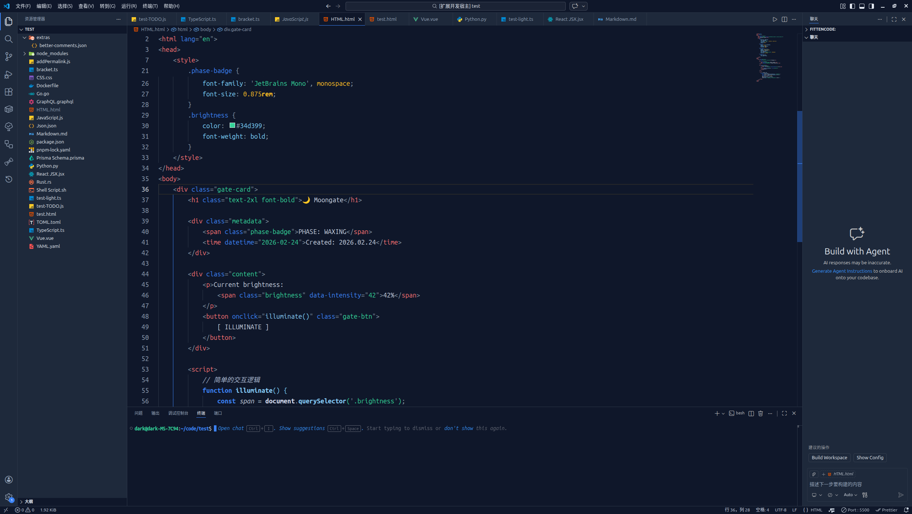
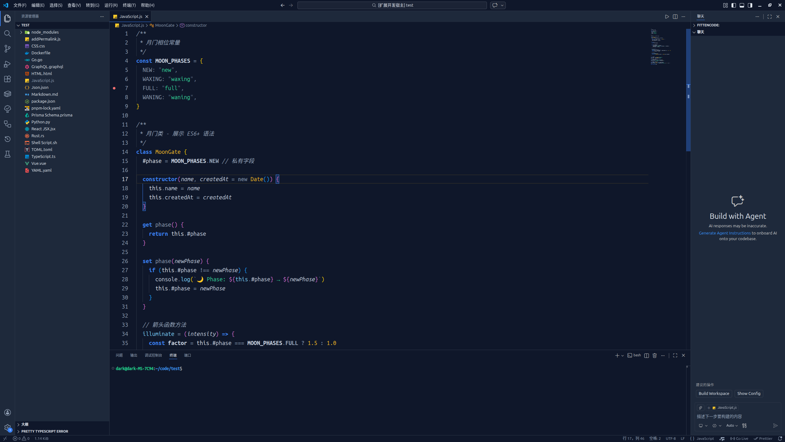
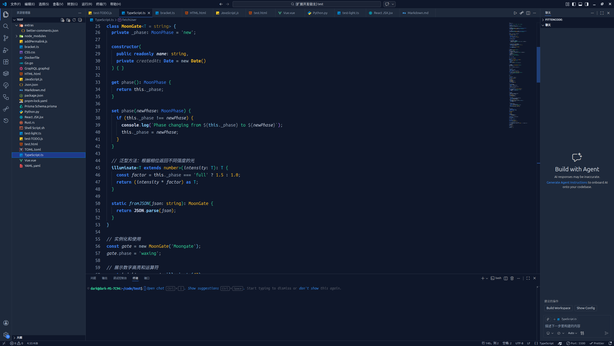
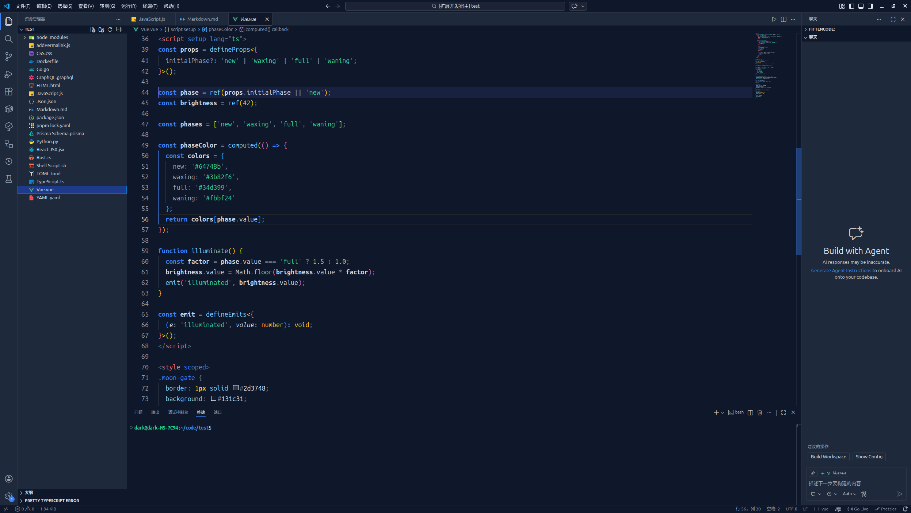
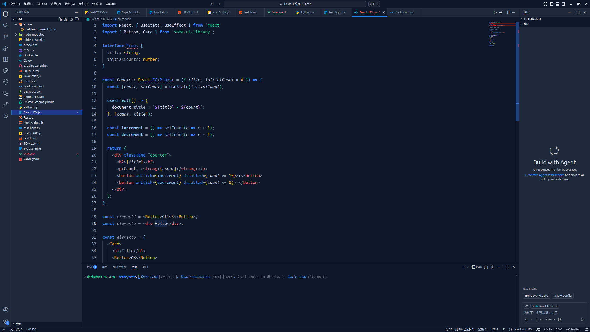
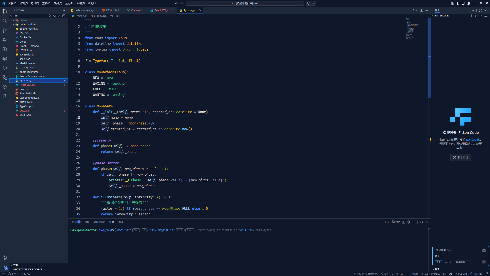
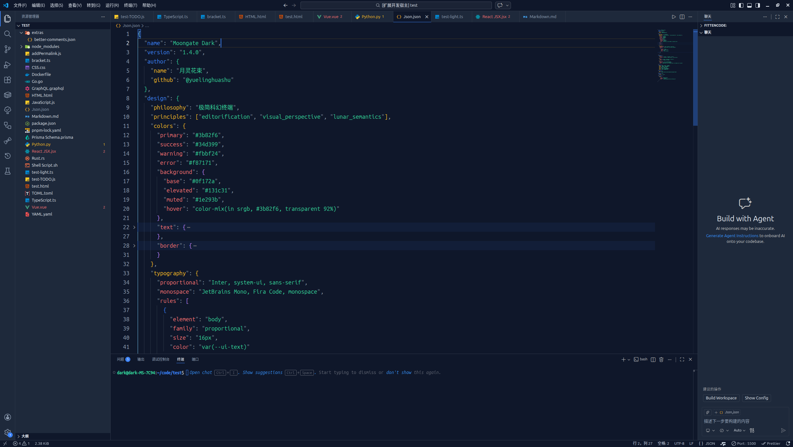
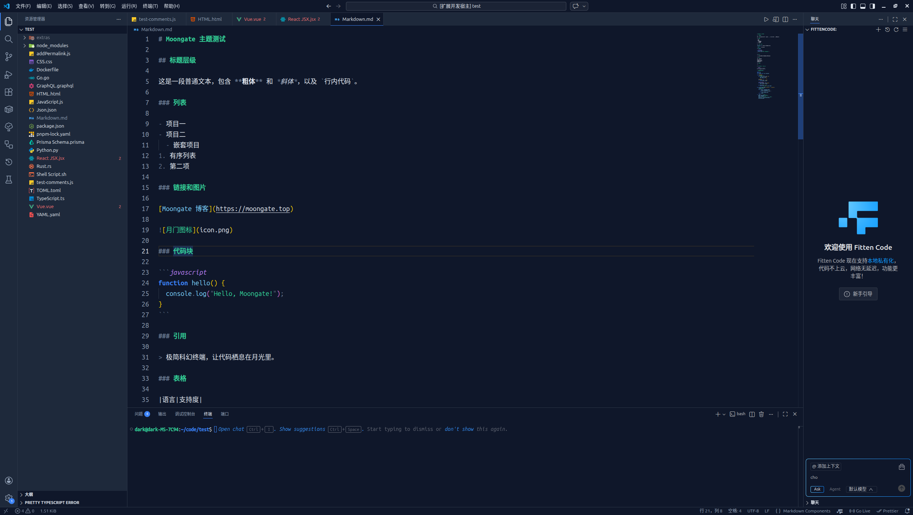

[]()
[]()

[中文](#Chinese) | [English](#English)

# 🌙 Moongate Theme

## 📸 预览(Preview)

### HTML



### JavaScript



### TypeScript



### Vue



### React



### Python



### Json



### Markdown



## <span id="Chinese">中文</span>

> 从博客到编辑器，让代码栖息在月光里

Moongate 是一个从个人博客 [moongate.top] 衍生而来的 VS Code 主题，
它将博客的视觉语言带到了代码编辑器中。

## ✨ 设计理念

- **月光般的柔和**：长时间 coding 不刺眼
- **门扉般的边界**：清晰的视觉层次
- **明暗两相宜**：陪伴你的每个 coding 时刻

## 🎨 配色系统

- 主色：取自月光的蓝调
- 背景：深夜天空般的深色，晨曦般的浅色
- 强调色：月光洒落的亮点

## 🧠 一些你可能没注意到，但我们已经考虑过的细节

| 优化项           | 常见主题的问题                             | Moongate 的解法                                |
| ---------------- | ------------------------------------------ | ---------------------------------------------- |
| **键值对区分**   | 对象的键和值颜色相同，JSON 难以扫读        | 键用月灰 (`#94a3b8`)，值保持主色，结构一目了然 |
| **链式调用优化** | `.map().filter().reduce()` 整条链颜色一样  | 方法名高亮，点操作符淡化，每一步清晰可见       |
| **形参特殊化**   | 函数参数和普通变量没区别，签名淹没在代码中 | 参数用斜体 + 稍淡色，与函数体分离              |
| **只读变量标记** | `const` 常量与普通变量无视觉差异           | 只读变量用斜体，暗示“不可变”属性               |
| **泛型参数识别** | TypeScript 泛型淹没在类型中                | 泛型参数用青色 (`#22d3ee`)，特殊语法一眼可辨   |
| **装饰器突出**   | Python 装饰器与普通函数混同             | 装饰器用紫色 (`#c084fc`) + 斜体，元数据显性化  |

这些优化可能看起来很细，但它们正是你每天编码时，眼睛不知不觉疲劳的根源。Moongate 替你把它们一一抚平。

## ⚙️ 推荐配置

### 语义高亮

为了获得 Moongate 最佳的视觉体验，建议开启 VS Code 的语义高亮功能：

1. 打开设置（`Ctrl+,`）
2. 搜索 `editor.semanticHighlighting.enabled`
3. 勾选 **Enabled**（或者直接在 `settings.json` 中添加）：

```json
{
  "editor.semanticHighlighting.enabled": true
}
```

开启后，Moongate 会对变量、参数、属性等进行精细的亮度分层，大幅提升代码可读性。

### 与 Better Comments 插件搭配

如果你使用 Better Comments 插件，可以应用 Moongate 的官方配色预设：

1. 打开 VS Code 设置（JSON 格式）

2. 将 extras/better-comments.json 中的内容合并到 better-comments.tags 字段中

3. 保存后即可看到特殊注释呈现 Moongate 专属色彩。

[⬆ 返回顶部](#)

## <span id="English">English</span>

> From blog to editor, let your code rest in moonlight

Moongate is a VS Code theme born from my personal blog [moongate.top]. It brings the same visual language you loved on my blog into your code editor — minimalist, sci-fi, terminal-inspired.

## ✨ Design Philosophy

- **Soft as moonlight**: Easy on the eyes during long coding sessions
- **Clear as a gate**: Visual hierarchy that doesn't get in your way
- **Day and night**: Thoughtfully balanced for both dark and light modes

## 🎨 Color System

- **Primary**: Blues inspired by moonlight
- **Background**: Deep night sky in dark mode, dawn-like lightness in light mode
- **Accent**: Highlights sprinkled like moonlight

## 🧠 The Details That Make a Difference

Most themes stop at syntax highlighting. Moongate goes deeper — into semantics. Here are some things you might not have realized you were missing:

| What You Might Have Missed | The Problem with Most Themes                                                                                                | How Moongate Fixes It                                                                           |
| -------------------------- | --------------------------------------------------------------------------------------------------------------------------- | ----------------------------------------------------------------------------------------------- |
| **Keys vs. Values**        | In JSON and objects, keys and values look the same. Scanning for property names becomes a chore.                            | Keys get a distinct moon gray (`#94a3b8`), values keep their natural color. Structure emerges.  |
| **Chained Method Calls**   | A long chain of `.map().filter().reduce()` is just one long blur. Good luck finding where one step ends and another begins. | Method names stay bright, while the dots fade into the background. Each step stands on its own. |
| **Function Parameters**    | Parameters blend in with local variables. The function signature drowns in its own body.                                    | Parameters are subtly dimmed and set in italic — separate, but not shouting.                    |
| **Read-Only Variables**    | `const` and other read-only values look exactly like anything else. No visual hint that they're special.                    | Read-only variables get a light italic touch — a quiet nudge that says "this won't change."     |
| **TypeScript Generics**    | Generics get lost in a sea of types. Spotting `<T>` in a complex signature shouldn't be a game of Where's Waldo.            | Generics stand out in cyan (`#22d3ee`). You'll never miss them again.                           |
| **Decorator Emphasis**             | In Python, decorators look like regular functions. That `@` is the only clue.                                 | Decorators are set in purple (`#c084fc`) and italic — metadata you can actually see.            |

These aren't flashy features. They're the small frictions you never knew were there — until they're gone. Moongate polishes them away, so you can focus on what matters: your code.

## ⚙️ Recommended Setup

### Semantic Highlighting

For the best Moongate experience, enabling VS Code's semantic highlighting is highly recommended:

1. Open settings (`Ctrl+,`)
2. Search for `editor.semanticHighlighting.enabled`
3. Check **Enabled** (or add it directly to your `settings.json`):

```json
{
  "editor.semanticHighlighting.enabled": true
}
```

Once enabled, Moongate applies fine-grained brightness layering to variables, parameters, and properties, significantly improving code readability.

### Pairing with Better Comments

If you use the Better Comments extension, you can apply Moongate's official color presets:

1. Open your VS Code settings (JSON format)
2. Merge the contents of `extras/better-comments.json` into the `better-comments.tags` field
3. Save the file, and your special comments will instantly display Moongate's exclusive colors.

[⬆ Back to top](#)

探索不息，编码不止 | Explore endlessly, code without ceasing

© 2026 MOONGATE
