[]()
[]()

[中文](#Chinese) | [English](#English)

# 🌙 Moongate Theme

## 📸 预览 (Preview)

### 深色 / 浅色对比

| 语言 | 深色 (Night Sky) | 浅色 (Dawn) |
|------|------------------|-------------|
| HTML | 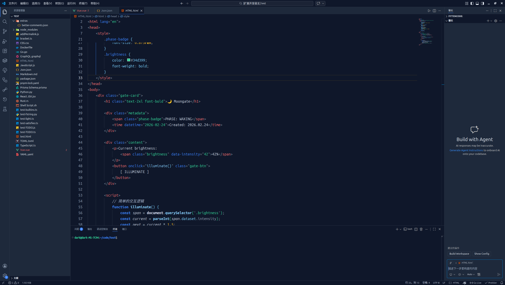 | 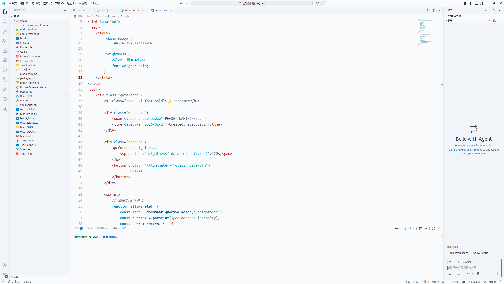 |
| JavaScript | 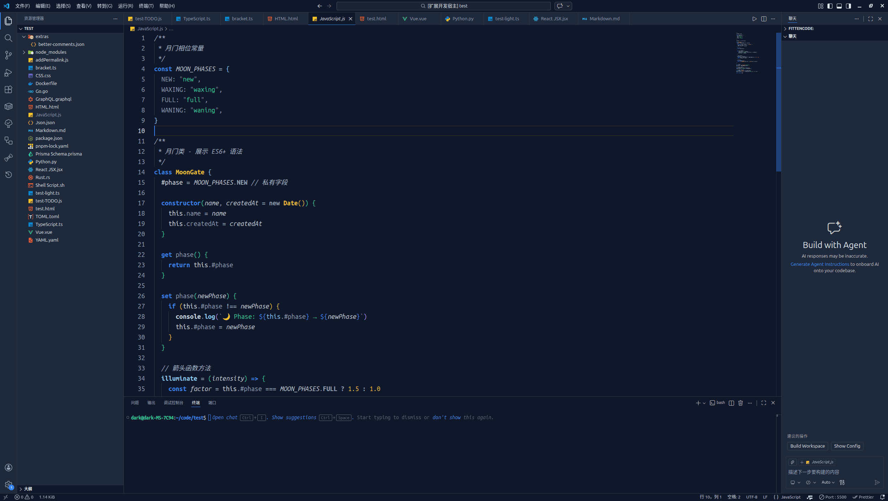 | 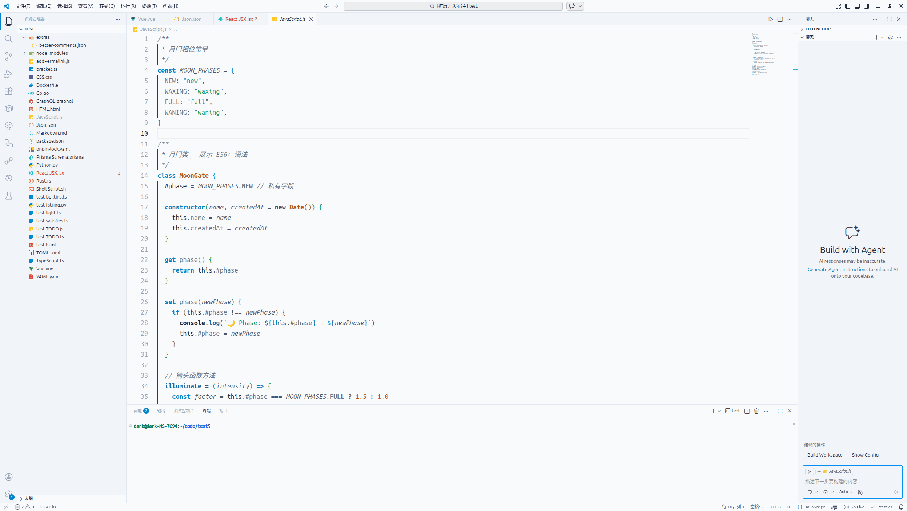 |
| TypeScript | 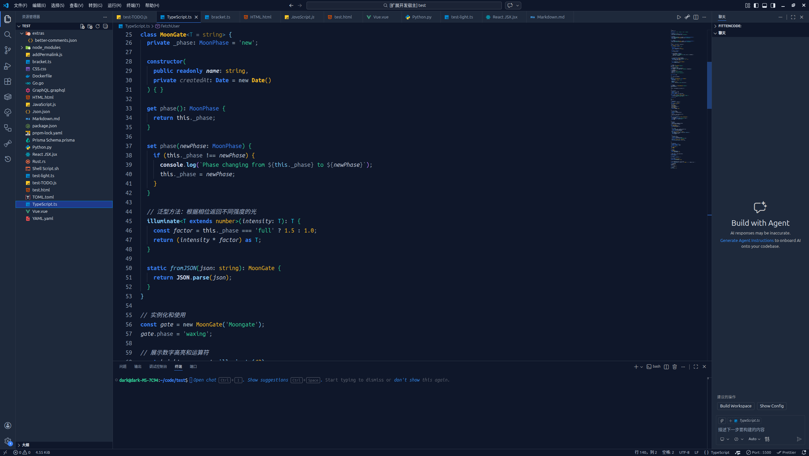 | 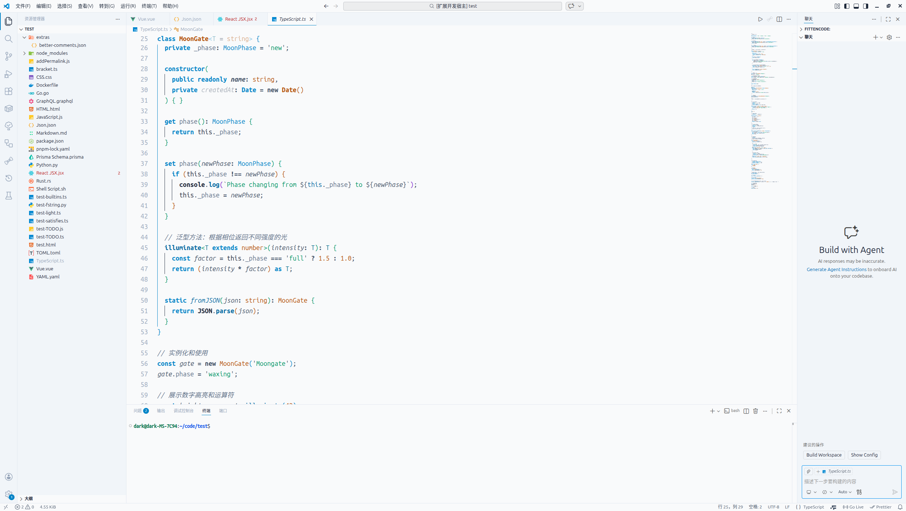 |
| Vue | 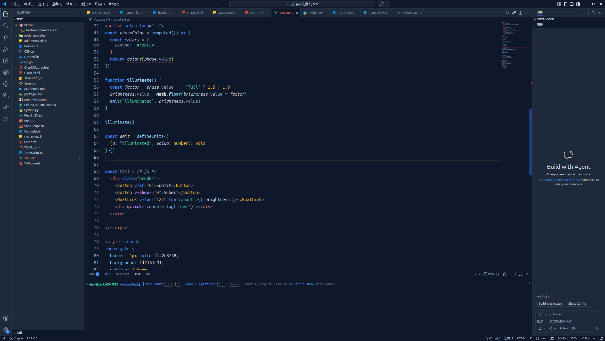 | 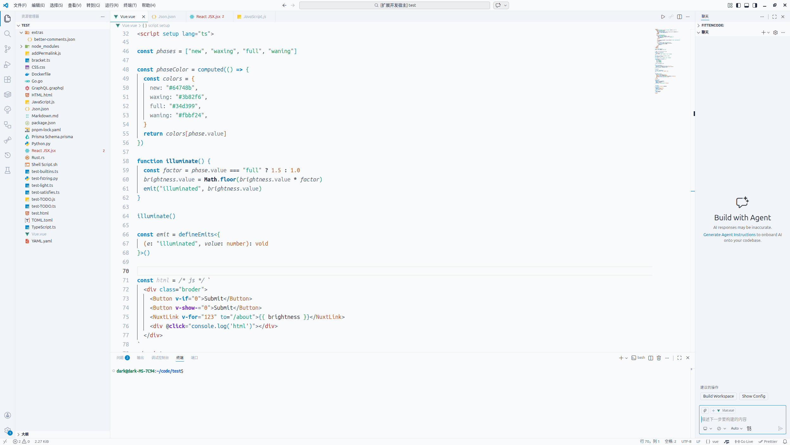 |
| React |  | 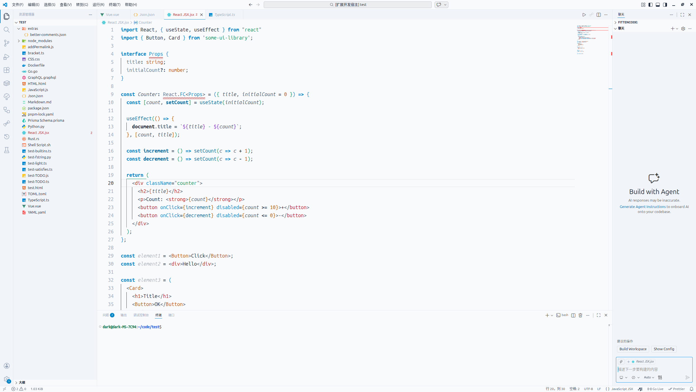 |
| Python | 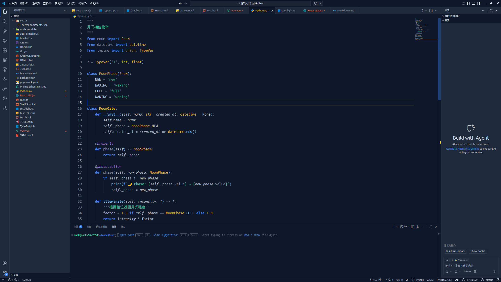 | 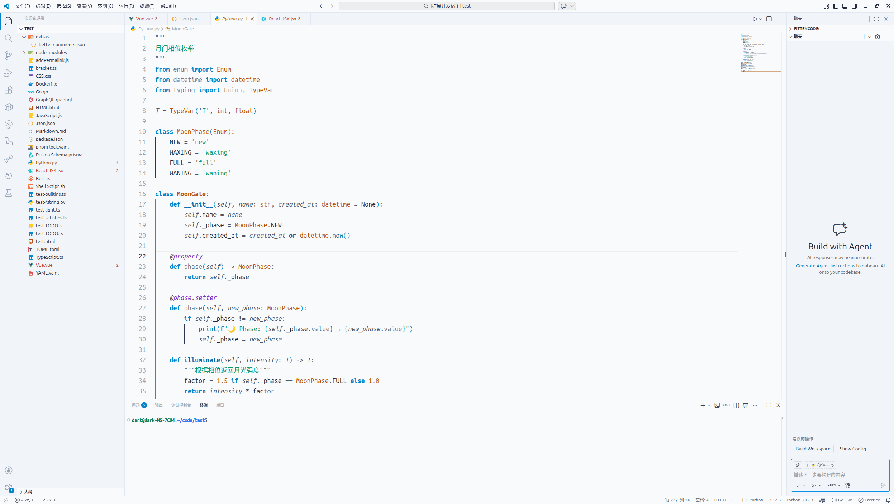 |
| JSON | 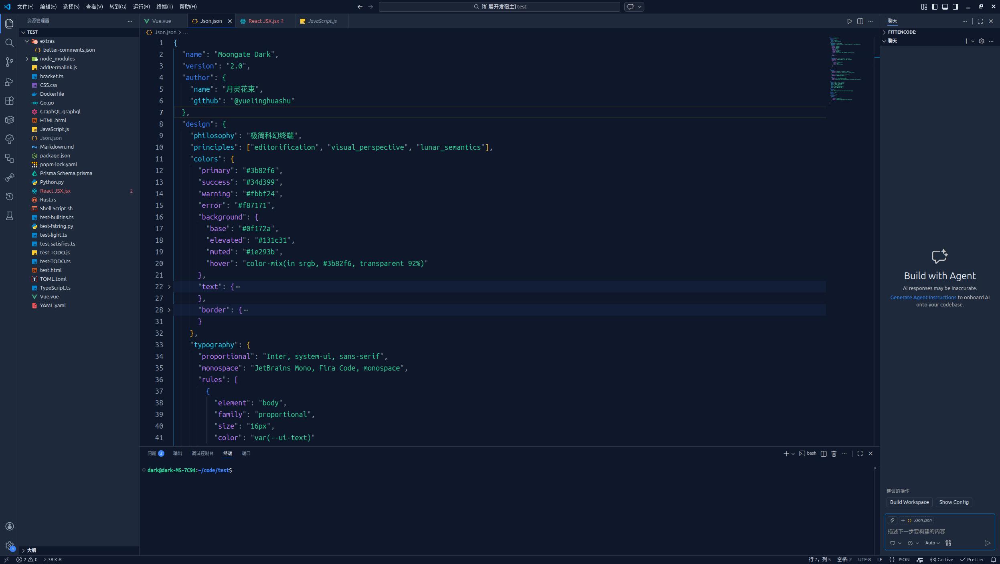 | 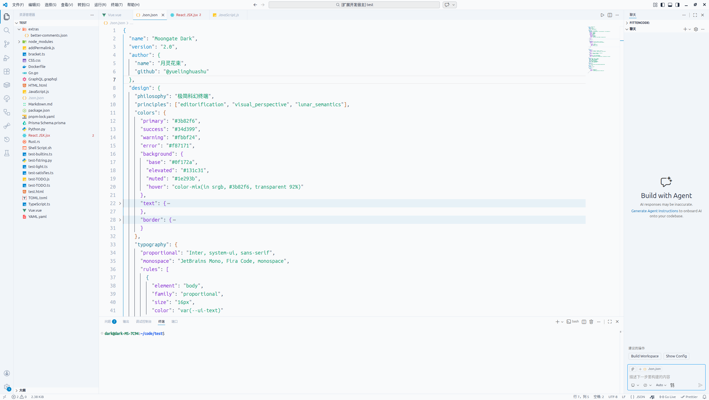 |
| Markdown |  | 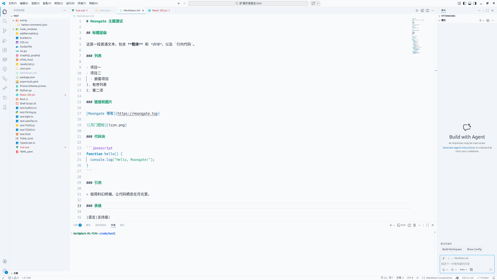 |

---

## <span id="Chinese">中文</span>

> 从博客到编辑器，让代码栖息在月光里

Moongate 是一个从个人博客 [moongate.top](https://moongate.top) 衍生而来的 VS Code 主题，它将博客的视觉语言带到了代码编辑器中。  
**v2.0 双子星版本** 首次带来完整的昼夜双主题：深色“晴夜”与浅色“晨曦”，通过**重力补偿**原则，让两种模式下语义一致、视觉重量对等。  
**v2.1.0 海拔系统** 进一步为 UI 注入物理深度，让界面层次从平面走向立体。  
**v2.2.0 工业级工程升级** 引入 DTCG 设计令牌标准，自动生成跨平台 CSS 变量，并内置 WCAG 对比度质检，确保设计系统严谨可靠。

## ✨ 设计理念

- **月光般的柔和**：长时间 coding 不刺眼  
- **门扉般的边界**：清晰的视觉层次  
- **明暗两相宜**：无论白天黑夜，始终舒适如一
- **🏔️ 物理海拔**：通过微妙的明度阶梯，让界面元素拥有真实的深度——侧边栏微微隆起，弹窗轻盈浮现，代码区沉静深邃  
- **📐 工程校准**：所有色值经过工业级校验，符合 WCAG 对比度标准，保证在任何屏幕上清晰可读

## 🎨 配色系统

- **主色**：取自月光的冷调蓝系（深色 `#3b82f6`，浅色 `#0284c7`）
- **背景**：深空 `#0f172a` / 冷月白 `#f9fafb`
- **强调色**：根据语义分层，形成亮度阶梯
- **🏔️ 海拔色**：新增四层明度阶梯（地面 `surfaceGround`、隆起 `surfaceRaised`、漂浮 `surfaceFloating`、提示 `surfaceTooltip`），让界面拥有真实的物理深度
- **🎨 设计令牌**：基于 DTCG 标准，原始值、语义层、组件层分离，自动生成 CSS 变量供博客和 UI 组件库使用

## 📐 设计系统

Moongate 基于 DTCG 设计令牌标准构建，所有颜色、海拔层级、对比度数据均已文档化，确保设计语言在各平台保持一致。  
👉 [查看完整设计系统文档](./docs/DESIGN_SYSTEM.md)

## 🧠 你可能没注意到，但我们已经考虑过的细节

| 优化项 | 常见主题的问题 | Moongate 的解法 |
|--------|----------------|------------------|
| **昼夜语义一致性** | 深色和浅色像两个主题，切换后需要重新适应 | **重力补偿**：同一色系不同明度，视觉重量对等，切换主题无感 |
| **JSON 嵌套深度** | 嵌套 JSON 难以快速定位层级 | **蓝 → 青 → 紫 阶梯**：顶层键 `primary`，二层 `cyan`，三层 `purple`，层次分明 |
| **私有字段标记** | JS/TS 私有字段 `#field` 与普通变量无异 | 私有字段用红月 `#f87171`，一眼识别封装状态 |
| **只读变量标记** | `const` 与普通变量无视觉差异 | 只读变量用**斜体**，暗示“不可变” |
| **泛型参数识别** | TypeScript 泛型淹没在类型中 | 泛型参数用青色 `#22d3ee`，特殊语法一眼可辨 |
| **装饰器突出** | Python 装饰器与普通函数混同 | 装饰器用紫色 `#c084fc` + 斜体，元数据显性化 |
| **终端颜色同步** | 终端输出与编辑器配色割裂 | 16 色 ANSI 完全映射到主题语义色，输出即代码 |
| **界面层次感** | UI 元素（侧边栏、弹窗）与背景粘连，缺乏深度 | **海拔系统**：为不同 UI 区域分配明度阶梯（`surfaceGround` → `surfaceRaised` → `surfaceFloating`），深色模式逐级增亮，浅色模式逐级加深，实现自然的“纸张层叠” |
| **设计系统一致性** | 博客、UI 组件库与编辑器颜色脱节 | **DTCG 设计令牌**：自动生成 CSS 变量（`moongate-tokens.css`），一套颜色贯穿所有数字产品 |

<details>
<summary>📋 点击查看 Moongate 完整优化项清单（共 20+ 项）</summary>

### 🧠 基础语法优化

- **键值对区分**：键用月灰 (`#94a3b8`)，值保持主色
- **链式调用优化**：方法名高亮，点操作符淡化
- **形参特殊化**：参数斜体 + 稍淡色
- **只读变量标记**：只读变量斜体
- **泛型参数识别**：泛型参数青色 (`#22d3ee`)
- **装饰器突出**：装饰器紫色斜体 (`#c084fc`)

### 🧠 语义修饰符深度定制

- **函数定义加粗**：与调用区分
- **静态成员斜体**
- **废弃标记删除线**
- **异步函数加粗斜体**
- **抽象类/方法斜体**
- **内置对象加粗**

### 🧠 跨语言与集成优化

- **终端颜色同步**：ANSI 16色映射
- **括号高亮月语义化**：6层嵌套色
- **JSDoc/TSDoc 高亮**：标签蓝、参数绿、类型发光蓝
- **混合语言嵌入**：组件月光黄，标签红色
- **特殊注释高亮**：Better Comments 官方预设
- **Python 装饰器统一**：紫色斜体
- **Vue 指令高亮**：紫色加粗
- **搜索结果高亮分层**：当前匹配项主蓝背景+边框，其他匹配项更淡
- **JSON 嵌套色阶**：蓝 → 青 → 紫

</details>

## ✨ v2.2.0 版本亮点

- **🎨 DTCG 设计令牌标准**：三层架构（原始值 → 语义层 → 组件层），颜色管理规范化，为跨平台复用（博客、UI 组件库）奠定基础。
- **🏔️ 海拔系统深度优化**：浅色模式采用“越高越亮”原则，侧边栏纯白，编辑器微冷白，弹窗边框更清晰；深色模式层次进一步强化。
- **🛠️ 工业级构建脚本**：内置颜色标准化、循环引用检测、透明度安全网；自动校验 WCAG 对比度，不合格即中断构建，保证主题可读性。
- **📄 自动生成设计资产**：输出 `moongate-tokens.css`（供博客/组件库使用）和 `DESIGN_SYSTEM.md`（完整设计系统文档），实现设计语言统一。
- **🔧 终端可读性增强**：浅色模式下 `ansiWhite` 调整为浅灰，避免文字消失。

[📜 查看完整更新日志](./CHANGELOG.md)

## ⚙️ 推荐配置

### 显示器校准

为了确保 Moongate 的月光能在你的屏幕上准确还原，我们准备了一份 **《视觉契约》** 显示器校准指南，帮助你找到最适合硬件的设置。详见 `extras/VISUAL_CONTRACT.md` 或 [在线查看](./extras/VISUAL_CONTRACT.md)。

### 语义高亮

为了获得 Moongate 最佳的视觉体验，建议开启 VS Code 的语义高亮功能：

1. 打开设置（`Ctrl+,`）
2. 搜索 `editor.semanticHighlighting.enabled`
3. 勾选 **Enabled**（或者直接在 `settings.json` 中添加）：

```json
{
  "editor.semanticHighlighting.enabled": true
}
```

开启后，Moongate 会对变量、参数、属性等进行精细的亮度分层，大幅提升代码可读性。

### 与 Better Comments 插件搭配

如果你使用 Better Comments 插件，可以应用 Moongate 的官方配色预设：

1. 打开 VS Code 设置（JSON 格式）
2. 将 `extras/better-comments.json` 中的内容合并到 `better-comments.tags` 字段中
3. 保存后即可看到特殊注释呈现 Moongate 专属色彩。

[⬆ 返回顶部](#)

---

## <span id="English">English</span>

> From blog to editor, let your code rest in moonlight

Moongate is a VS Code theme born from my personal blog [moongate.top](https://moongate.top). It brings the same visual language you loved on my blog into your code editor — minimalist, sci-fi, terminal-inspired.  
**v2.0 Gemini Release** introduced a complete dual‑theme system: dark “Night Sky” and light “Dawn”. Through **gravity compensation**, both modes share identical semantics with equal visual weight.  
**v2.1.0 Elevation System** brought physical depth to the UI, taking the interface from flat to layered.  
**v2.2.0 Industrial‑Grade Engineering** introduces the DTCG design token standard, automatically generates cross‑platform CSS variables, and includes built‑in WCAG contrast validation – ensuring a robust design system.

## ✨ Design Philosophy

- **Soft as moonlight**: Easy on the eyes during long coding sessions
- **Clear as a gate**: Visual hierarchy that doesn't get in your way
- **Day and night**: Thoughtfully balanced for both dark and light environments
- **🏔️ Physical elevation**: Subtle lightness steps give real depth – sidebars gently lift, popups float, the editor recedes.
- **📐 Engineering calibration**: Every color value is validated against WCAG standards, guaranteeing legibility on any screen.

## 🎨 Color System

- **Primary**: Cool blues inspired by moonlight (dark `#3b82f6`, light `#0284c7`)
- **Background**: Deep night sky `#0f172a` / cold moon white `#f9fafb`
- **Accents**: Layered by semantics, forming a brightness ladder
- **🏔️ Elevation colors**: Four new lightness steps (`surfaceGround`, `surfaceRaised`, `surfaceFloating`, `surfaceTooltip`) bring authentic physical depth to the interface.
- **🎨 Design tokens**: DTCG‑based architecture with primitives, semantics, and components – automatically generates CSS variables for use in blogs and UI component libraries.


## 📐 Design System

Moongate is built on the DTCG design token standard. All colors, elevation layers, and contrast data are fully documented, ensuring a consistent design language across platforms.  
👉 [View the complete design system documentation](./docs/DESIGN_SYSTEM.md)

## 🧠 The Details That Make a Difference

| What You Might Have Missed | The Problem with Most Themes | How Moongate Fixes It |
|----------------------------|------------------------------|------------------------|
| **Day‑Night Semantic Consistency** | Dark and light feel like different themes; you have to re-learn the mapping | **Gravity compensation**: same hue family, different lightness – seamless switch |
| **JSON Nesting Depth** | Hard to quickly locate levels in deeply nested JSON | **Blue → Cyan → Purple gradient**: top keys `primary`, second `cyan`, third `purple` |
| **Private Field Marking** | JS/TS `#field` looks like any other variable | Private fields use red moon `#f87171` – encapsulation visible at a glance |
| **Read-Only Variables** | `const` variables look identical to mutable ones | Read-only variables are **italic** – a subtle hint of immutability |
| **Generic Parameter Recognition** | TypeScript generics get lost in a sea of types | Generics stand out in cyan `#22d3ee` |
| **Decorator Emphasis** | Python decorators blend with regular functions | Decorators are purple `#c084fc` + italic – metadata you can actually see |
| **Terminal Color Sync** | Terminal output feels disconnected from the editor | 16‑color ANSI fully mapped to theme semantics – output matches code |
| **UI Layering** | UI elements (sidebar, popups) stick to the background, lacking depth | **Elevation System**: lightness steps (`surfaceGround` → `surfaceRaised` → `surfaceFloating`) create a natural paper‑stack effect in both dark and light modes. |
| **Design System Consistency** | Blog and UI component colors diverge from the editor | **DTCG Design Tokens**: Automatically generate CSS variables (`moongate-tokens.css`) – one color language across all your digital products. |

<details>
<summary>📋 Click to view Moongate's complete optimization list (20+ items)</summary>

### 🧠 Basic Syntax Optimizations

- **Key‑Value Distinction**: Keys in moon gray (`#94a3b8`), values keep primary colors
- **Chain Call Optimization**: Method names highlighted, dots dimmed
- **Parameter Specialization**: Parameters in italic + slightly dimmed
- **Read‑only Variable Marking**: Read‑only variables in italic
- **Generic Parameter Recognition**: Generic parameters in cyan (`#22d3ee`)
- **Decorator Emphasis**: Decorators in purple (`#c084fc`) + italic

### 🧠 Deep Customization of Semantic Modifiers

- **Function definitions bold**: Distinguished from calls
- **Static members italic**
- **Deprecated symbols strikethrough**
- **Async functions bold italic**
- **Abstract classes/methods italic**
- **Built‑in objects bold**

### 🧠 Cross‑language & Integration Optimizations

- **Terminal color sync**: 16 ANSI colors mapped to lunar semantics
- **Lunar semantic bracket highlighting**: 6‑level nested colors
- **JSDoc/TSDoc highlighting**: Tags blue, parameters green, types glowing blue
- **Mixed language embedding**: Components moon yellow, tags red
- **Special comment highlighting**: Official Better Comments presets
- **Python decorators unified**: Purple italic
- **Vue directives highlighting**: Purple bold
- **Search result layering**: Current match with primary‑blue background + border, other matches dimmed
- **JSON nesting color gradient**: Blue → Cyan → Purple

</details>

## ✨ v2.2.0 Highlights

- **🎨 DTCG Design Token Standard**: Three‑layer architecture (Primitives → Semantics → Components) – standardized color management, ready for cross‑platform reuse.
- **🏔️ Elevation System Refinements**: Light mode now uses “higher = brighter” logic – pure white sidebars, subtle cool‑white editor, sharper popup borders. Dark mode layering is further enhanced.
- **🛠️ Industrial‑Grade Build Script**: Includes color normalization, circular reference detection, alpha‑safety net, and WCAG contrast validation – any failing check halts the build.
- **📄 Automated Design Assets**: Generates `moongate-tokens.css` (for blogs/UI libraries) and `DESIGN_SYSTEM.md` (complete design system documentation) – one source of truth for all products.
- **🔧 Terminal Readability**: Light mode `ansiWhite` adjusted to light gray to prevent invisible text.

[📜 View full changelog](./CHANGELOG.md)

## ⚙️ Recommended Setup

### Monitor Calibration

To ensure Moongate’s moonlight renders faithfully on your screen, we have prepared a monitor calibration guide – the **Visual Contract**. It helps you find the settings that best suit your hardware. See `extras/VISUAL_CONTRACT.md` or [view online](./extras/VISUAL_CONTRACT.md).

### Semantic Highlighting

For the best Moongate experience, enabling VS Code's semantic highlighting is highly recommended:

1. Open settings (`Ctrl+,`)
2. Search for `editor.semanticHighlighting.enabled`
3. Check **Enabled** (or add it directly to your `settings.json`):

```json
{
  "editor.semanticHighlighting.enabled": true
}
```

Once enabled, Moongate applies fine‑grained brightness layering to variables, parameters, and properties, significantly improving code readability.

### Pairing with Better Comments

If you use the Better Comments extension, you can apply Moongate's official color presets:

1. Open your VS Code settings (JSON format)
2. Merge the contents of `extras/better-comments.json` into the `better-comments.tags` field
3. Save the file, and your special comments will instantly display Moongate's exclusive colors.

[⬆ Back to top](#)

---

探索不息，编码不止 | Explore endlessly, code without ceasing

© 2026 MOONGATE
