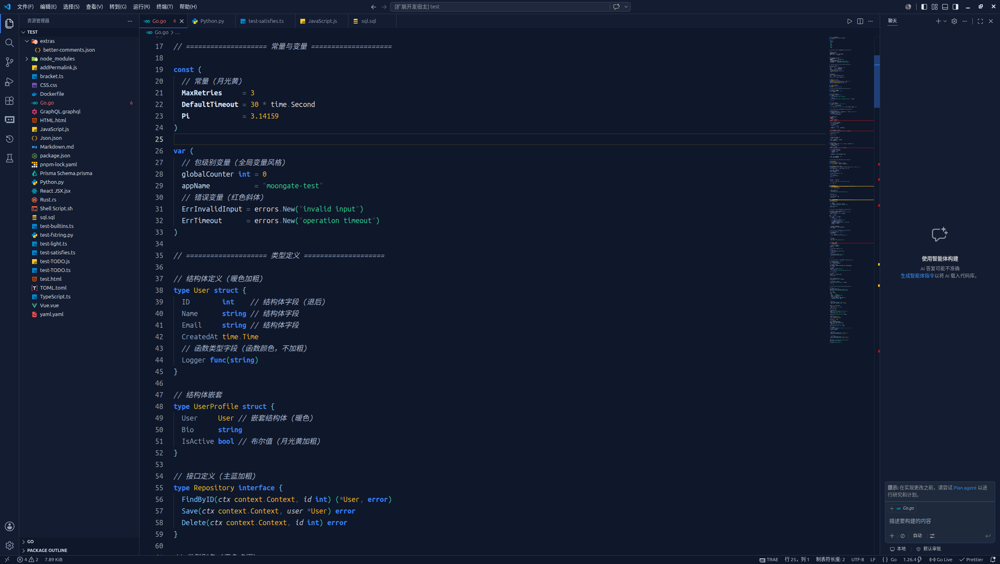
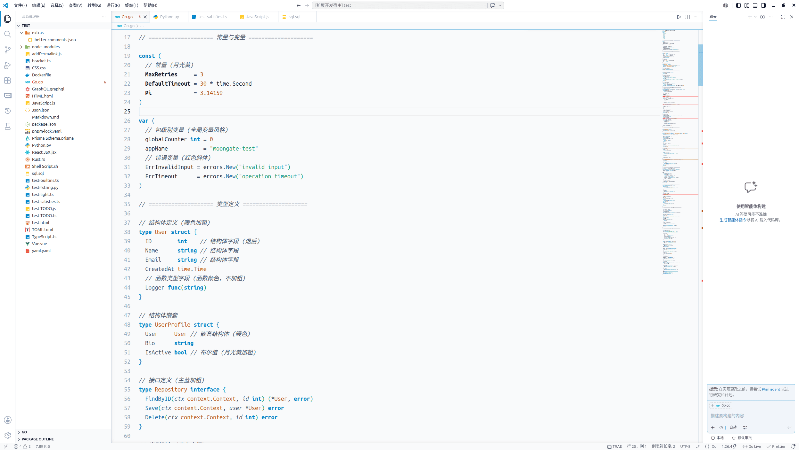

[]()
[]()

[中文](#chinese) | [English](#english)

---

## <span id="chinese">中文</span>

# 🌙 Moongate Theme

> 从博客到编辑器，让代码栖息在月光里

Moongate 是一个从个人博客 [moongate.top](https://moongate.top) 衍生而来的 VS Code 主题，将博客的视觉语言带到代码编辑器中。

**v2.4.0 代码精简与视觉统一**：语言配置全面精简，Rust 函数样式统一，TypeScript 内置对象视觉一致，构建脚本自动合并 token 规则，JSON 体积减小 16%。

## 📸 预览

| 语言       | 深色                                     | 浅色                                      |
| ---------- | ---------------------------------------- | ----------------------------------------- |
| JavaScript |  |  |
| Python     |  |  |
| Go         |          |          |
| Vue        |        |        |

## ✨ 设计理念

- **月光般的柔和**：长时间 coding 不刺眼
- **清晰的边界**：分明的视觉层次
- **昼夜皆宜**：深色/浅色双主题，切换无感
- **物理海拔**：侧边栏隆起，弹窗浮现，编辑器沉静
- **工程校准**：所有色值通过 WCAG 对比度校验

## 🎨 配色系统

- **主色**：冷调月蓝（深色 `#3b82f6` / 浅色 `#0284c7`）
- **背景**：深空 `#0f172a` / 冷月白 `#f9fafb`
- **海拔层级**：四层明度阶梯（`surfaceGround` → `surfaceRaised` → `surfaceFloating` → `surfaceTooltip`）
- **设计令牌**：基于 DTCG 标准，自动生成 CSS 变量供跨平台复用

## 🧠 核心优化

| 优化项                | Moongate 的解法                                        |
| --------------------- | ------------------------------------------------------ |
| **昼夜语义一致性**    | 同一色系不同明度，视觉重量对等，切换无感               |
| **函数定义/调用分离** | 定义加粗，调用不加粗，全语言统一（Go、Python、JS、TS） |
| **JSON 嵌套层级**     | 蓝 → 青 → 紫 阶梯，层次一目了然                        |
| **UI 物理深度**       | 海拔系统：不同 UI 区域分配明度阶梯，实现"纸张层叠"     |
| **设计系统统一**      | DTCG 令牌自动生成 CSS 变量，一套颜色贯穿所有产品       |

## ✨ v2.4.0 亮点

- **🧹 语言配置全面精简**：各语言文件移除与 `base.yaml` 重复的通用规则，Rust 精简 63%、Python 精简 56%、CSS 精简 50%，维护成本大幅降低
- **🦀 Rust 函数样式统一**：Rust TextMate 无法区分函数定义与调用，统一加粗，与 Go 处理方式保持一致
- **🎯 TypeScript 内置对象一致**：修复 `JSON` 意外加粗问题，所有内置对象（`console`、`Math`、`JSON`）视觉风格统一
- **📦 构建脚本优化**：自动合并相同颜色的 token 规则，`tokenColors` 从 89 条精简至 34 条（减少 62%），JSON 体积减小 16%

[📜 查看完整更新日志](./CHANGELOG.md)

## 📐 设计系统

Moongate 基于 DTCG 设计令牌标准构建，提供完整的颜色、布局、排版、断点、z-index 令牌。  
👉 [查看完整设计系统文档](./docs/DESIGN_SYSTEM.md)  
👉 [使用颜色令牌驱动博客或 UI 组件库](./themes/moongate-colors.css)  
👉 [使用布局令牌（间距、排版、断点等）](./themes/moongate-layout.css)

## ⚙️ 推荐配置

### 语义高亮

安装 Moongate 后，语义高亮**自动开启**，无需任何手动配置。如遇问题，可检查：

```json
{
  "editor.semanticHighlighting.enabled": true
}
```

### Better Comments

使用 Better Comments 插件时，可应用 Moongate 官方配色预设：

1. 打开 VS Code 设置（JSON 格式）
2. 将 `extras/better-comments.json` 合并到 `better-comments.tags` 字段

---

[⬆ 返回顶部](#)

---

## <span id="english">English</span>

# 🌙 Moongate Theme

> From blog to editor, let your code rest in moonlight

Moongate is a VS Code theme born from [moongate.top](https://moongate.top), bringing the same visual language into your code editor.

**v2.4.0 Code Refinement & Visual Consistency**: Language configs deduplicated, Rust function styling unified, TypeScript built‑in objects consistent, build script auto‑merges token rules, JSON size reduced by 16%.

## 📸 Preview

| Language   | Dark                                     | Light                                      |
| ---------- | ---------------------------------------- | ------------------------------------------ |
| JavaScript |  |  |
| Python     |  |  |
| Go         |          |          |
| Vue        |        |        |

## ✨ Design Philosophy

- **Soft as moonlight**: Easy on the eyes
- **Clear boundaries**: Distinct visual hierarchy
- **Day & night**: Thoughtfully balanced dark/light themes
- **Physical elevation**: Sidebars lift, popups float, editor recedes
- **Engineering calibration**: All colors pass WCAG contrast validation

## 🎨 Color System

- **Primary**: Cool lunar blue (dark `#3b82f6` / light `#0284c7`)
- **Background**: Night sky `#0f172a` / moon white `#f9fafb`
- **Elevation**: Four lightness steps (`surfaceGround` → `surfaceRaised` → `surfaceFloating` → `surfaceTooltip`)
- **Design tokens**: DTCG‑based, auto‑generates CSS variables for cross‑platform reuse

## 🧠 Core Optimizations

| Optimization                     | How Moongate Fixes It                                           |
| -------------------------------- | --------------------------------------------------------------- |
| **Day‑Night Consistency**        | Same hue, different lightness – seamless switching              |
| **Function Def/Call Separation** | Definitions bold, calls not – unified across Go, Python, JS, TS |
| **JSON Nesting Depth**           | Blue → Cyan → Purple gradient – levels at a glance              |
| **UI Physical Depth**            | Elevation system – natural "paper stack" effect                 |
| **Design System Unity**          | DTCG tokens – one color language across all products            |

## ✨ v2.4.0 Highlights

- **🧹 Language configs deduplicated**: Removed rules duplicating `base.yaml` across all language files — Rust down 63%, Python 56%, CSS 50%, significantly reducing maintenance overhead
- **🦀 Rust function styling unified**: Rust's TextMate grammar cannot distinguish definitions from calls — both are now bold, consistent with Go's approach
- **🎯 TypeScript built‑in objects consistent**: Fixed unexpected `JSON` bolding — all built‑ins (`console`, `Math`, `JSON`) now share a consistent visual style
- **📦 Build script optimized**: Auto‑merges token rules with identical colors — `tokenColors` reduced from 89 to 34 rules (62% decrease), JSON size reduced by 16%

[📜 View full changelog](./CHANGELOG.md)

## 📐 Design System

Moongate is built on the DTCG design token standard, providing complete color, layout, typography, breakpoint, and z-index tokens.
👉 [View full documentation](./docs/DESIGN_SYSTEM.md)

## ⚙️ Recommended Setup

### Semantic Highlighting

After installing Moongate, semantic highlighting is **automatically enabled** – no manual setup required. If you encounter issues, verify:

```json
{
  "editor.semanticHighlighting.enabled": true
}
```

### Better Comments

Merge `extras/better-comments.json` into `better-comments.tags` in your VS Code settings.

---

[⬆ Back to top](#)

探索不息，编码不止 | Explore endlessly, code without ceasing

© 2026 MOONGATE
